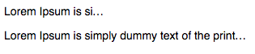

## ellipsis
A test on ellipsis.

Two examples are present here:
- One with the width set on itself;
- The other with the width set on the container.

One note:
- Width is required for ellipsis to work.

Another note (edit after *69* days):
- No it isn't. It just needs to overflow, dumbass Kier.