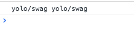

### path-browserify

Testing [**path browserify**](https://github.com/substack/path-browserify) if it works with Webpack. My main issue is with the name. It was a bit mis-leading; I thought it would only work with browserify. Although I checked the code, I wanted to make sure before installing it to an internal project.